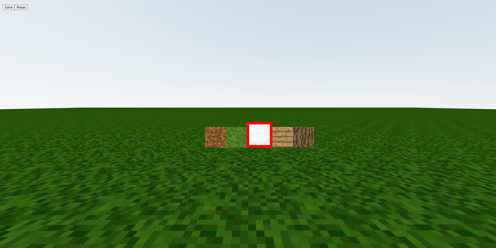
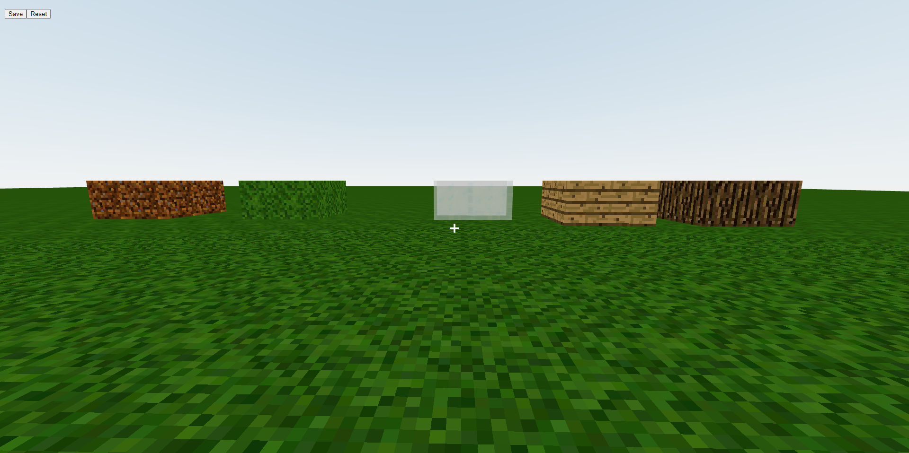
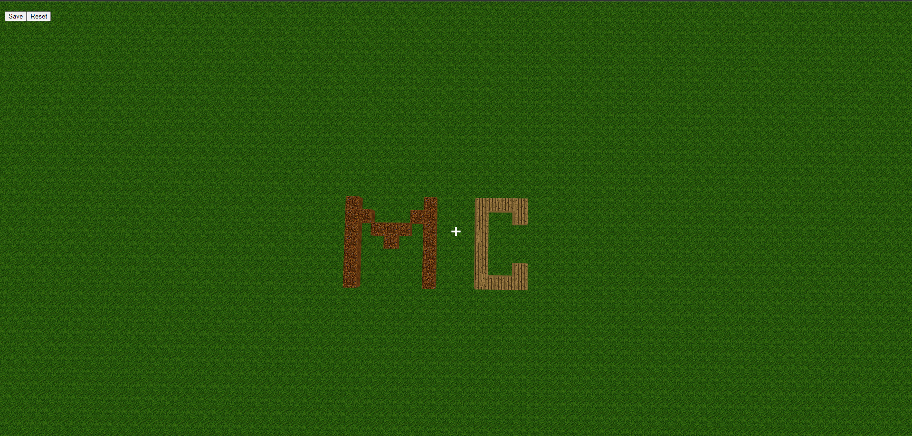

<h1> Minecraft clone using React.js</h1>
<a href = "https://minecraftonjs.netlify.app/"> CLICK TO PLAY</a>  
This project is build using JavaScript, React.js, Three.js

<h2> About</h2>
<ul>
  <li>
    Contains 5 types of blocks: Grass, Wood, Log, Glass and Dirt. Which could be updated in future.
  </li>
  
  <li>
    <strong>We can switch blocks with numbers 1-5 on keyboard.</strong>
  </li>
  
  <li>
    <strong>We can navigate the world with the mouse and WASD keys.</strong>
  </li>
  
  <li>
    <strong>We can use spacebar to jump as higher we want.</strong>
  </li>
  
  <li>
    We can click to add blocks and Alt+Click to remove blocks.
  </li>
  
  <li>
    Show your creativity and save it in your localStoarage, So that you can resume anytime anywhere.
  </li>
  
  <li>
    You can reset anytime to start over.
  </li>
</ul>

<h3>You can select among the 5 blocks to build your creativity on screen.</h3>

<h3>Just a sample of construction</h3>

<h3>Show creativity</h3>

